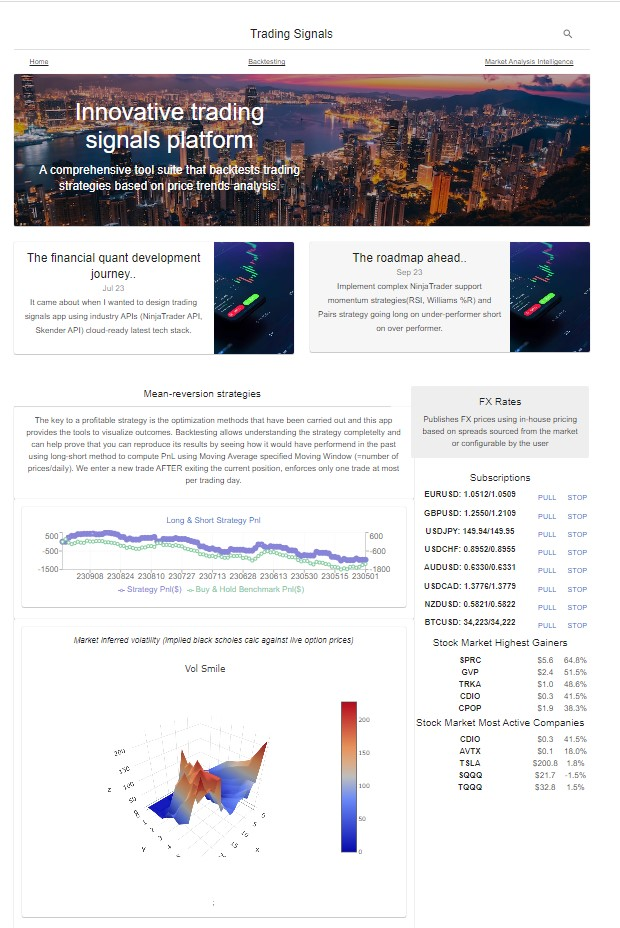
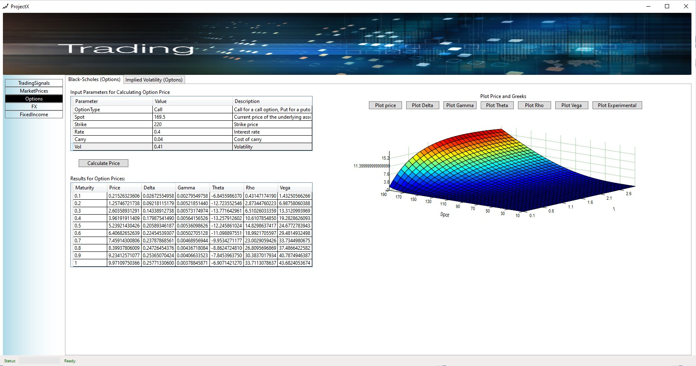
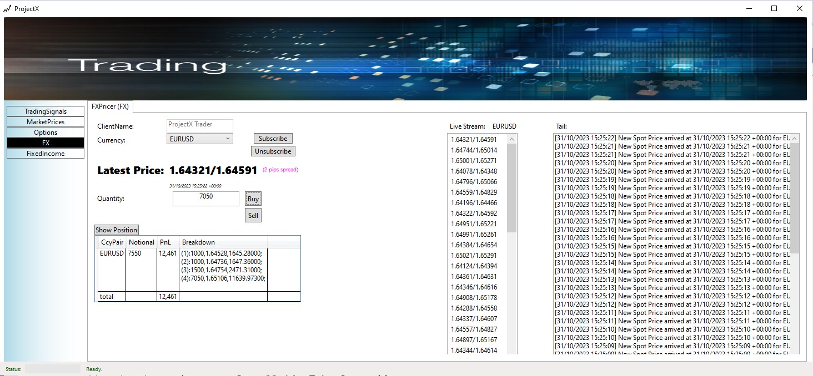

ProjectX🌊 is a technical analysis centric app that can backtest popular trading strategies such as the Long-Short trading strategy designed for the personal trader. 
I wrote ProjectX to collate my projects that I have built in github over the years back testing strategies, risk pricing C++ into a concise platform deliverable that showcases a decade plus of industry expertise in risk management and trading & execution systems.

We explore long-short strategy by using trend based mean reversion stock indicators; in this case the moving average stock indicator; a lagging indicator that can identify trends and reversals. 
Finding similar well-known trading strategies from public sources is easily accessible, the key for a profitable strategy is the optimization methods that have been carried out and this app provides the toolkit to support this endeavour.

The core compute engine is running on cloud-native ASP.NET Core with a Desktop UI (WPF) and the Web Portal front end (React). The compute engine is deployable cross platform (tested on Win/MacOs/Linux) tested with vc++ g++ .net mono pricers on standaloned servers.  Production deployed ASP.NET Core HostedService to Azure container app compute farm building out a grid of milliseconds latency native c++ linux and .net pricers enabling futue potential elastic computation growth. Regular CI/CD github actions azure deveops pipeline ensures continous delivery and HA.

Successful trading strategy development requires backtesting on historical real price data, 
ProjectX provides the following features to assist the optimization process:
* ability to design trading strategies for demo trade purposes and backtest said strategies by running a simulation on financial stocks like GOOGL, AAPL.
* captures live market data from reliable third party data sources such as FMP, Quandl

_Desktop App Backtesting:_

Deep dive into backtesting strategies: [strategies](STRATEGIES.md)

The supporting components relates to providing pricers to help explore advantagous and potential arbitrage opportunities, fine-tune pricing models, and understand market sentiment.
ProjectX provides the following highly customizable and optimizable toolkit
* ProjectX implements pricing models for FX products based on spreaded commisions, Options Pricing.
* Vanilla Options Black Scholes Pricer (C#)
* Vanilla Options BlackScholes Pricer (C++) lightning fast execution times to better support scalable valuation operations
* Vanilla Options MonteCarlo Options Pricer C++ using BSM to value greeks & BoxMuller Guassian RNG, normal distribution cdf, pdfs for modelling the stochastic functions of price changes
* Vanilla Options Heston MonteCarlo Pricer C++ an improvement to the BSM model as it takes into account stochastic volality 
* FX Pricing & Order management System
* QL.NET product pricer (future support experiment with popular opensource pricing library)
* Simple Bonds Pricer (in concept development phase, explore value add)
* CDS Pricer (in concept development phase,  explore value add)
* Implied Vol Pricer to help understand market sentiment (in concept development phase,  explore value add)
* Luxious Maui mobile iOS/Android RFQ spread adjustment with real-time updates to Windows/Mac desktop Maui driven real-time instrument quotes bloter (in concept development phase)

_Desktop App BS Option Pricing:_

_Desktop App FX OMS:_

------------------------------------------------------------------------------------------------------------------------------------------------------------------------
_Tech Stack:_
* C# 11, .NET 8, WPF, Caliburn.Micro, System.ComponentModel.Composition.Hosting.CompositionContainer (IoC), ReactiveX 6, Microsft Chart Controls
* C++ CLI, native C++ cross platform Win32/MacOs, PInvoke marshalling, cmake, BoxMuller RNG, cdf & pdf distributions
* ASPNET Core WebApi 6, SignalR, Background Services, .NET Channels, LiveCharts Skia, 
* Azure Cloud; GitHub Actions Azure Devops CI/CD pipeline, Azure Container App, Azure SignalR, Azure Web App, Azure Files Samba share, Azure Secrets
* React 8, Bootstrap, Typescript, recharts,
* StockIndicators Skender API,  NinjaTrader StockInidicator API, FinancialModellingPrep MarketData API, Quandl MarketData API
* Trend indicator methods: Bollinger Bands, Moving Averages
 
.
