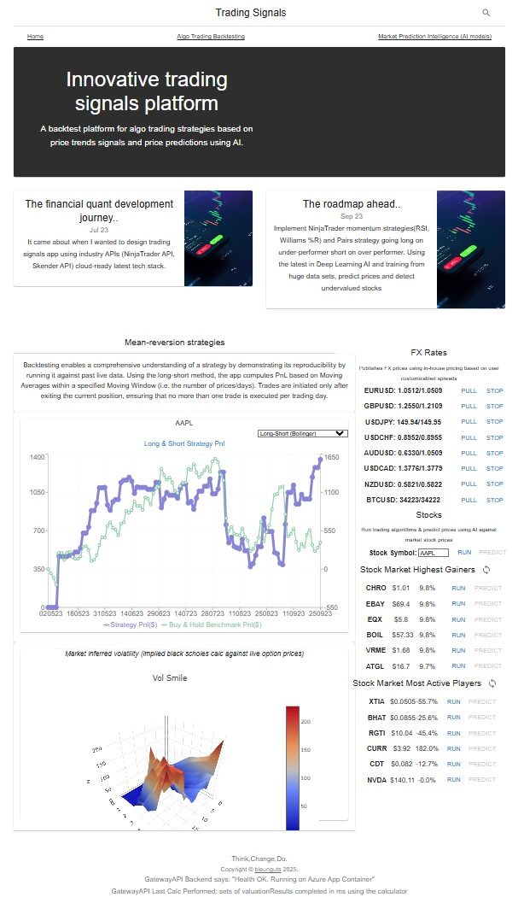

ProjectX🌊 is a technical analysis centric app that can backtest popular trading strategies such as the Long-Short trading strategy designed for the personal trader. 
I wrote ProjectX to collate my projects that I have built in github over the years back testing strategies, risk pricing C++ into a concise platform deliverable that showcases a decade plus of industry expertise in risk management and trading & execution systems.

We explore long-short strategy by using trend based mean reversion stock indicators; in this case the moving average stock indicator; a lagging indicator that can identify trends and reversals. 
Finding similar well-known trading strategies from public sources is easily accessible, the key for a profitable strategy is the optimization methods that have been carried out and this app provides the toolkit to support this endeavour.

The core compute engine is running on cloud-compatabile ASP.NET Core with a Desktop UI (WPF) and a Web Portal front end (React).

Successful trading strategy development requires backtesting on historical real price data, 
ProjectX provides the following features to assist the optimization process:
* ability to design trading strategies for demo trade purposes and backtest said strategies by running a simulation on financial stocks like GOOGL, AAPL.
* captures live market data from reliable third party data sources such as FMP, Quandl

_Desktop App Backtesting:_

Deep dive into backtesting strategies: [strategies](STRATEGIES.md)

The supporting components relates to providing pricers to help explore advantagous and potential arbitrage opportunities, fine-tune pricing models, and understand market sentiment.
ProjectX provides the following highly customizable and optimizable toolkit
* ProjectX implements pricing models for FX products based on spreaded commisions, Options Pricing.
* Vanilla Options Black Scholes Pricer (C#)
* Vanilla Options BlackScholes Pricer (C++) lightning fast execution times to better support scalable valuation operations
* Vanilla Options MonteCarlo Options Pricer C++ with BoxMuller Guassian RNGs and normal distribution cdf, pdfs for modelling the stochastic functions of price volatilities
* FX Pricing & Order management System
* QL.NET product pricer (future support experiment with popular opensource pricing library)
* Simple Bonds Pricer (in concept development phase, explore value add)
* CDS Pricer (in concept development phase,  explore value add)
* Implied Vol Pricer to help understand market sentiment (in concept development phase,  explore value add)

_Desktop App BS Option Pricing:_

_Desktop App FX OMS:_

------------------------------------------------------------------------------------------------------------------------------------------------------------------------
_Tech Stack:_
* C# 11, .NET 7, WPF, Caliburn.Micro, System.ComponentModel.Composition.Hosting.CompositionContainer (IoC), ReactiveX 6, Microsft Chart Controls,
* C++ CLI interop, native C++, box muller RNG, std::erf cdf and pdf
* ASPNET Core WebApi 6, SignalR, .NET Json Serialization & attribute validation, Background Services (Azure Ready), LiveCharts Skia
* React 8, Bootstrap,  Typescript, recharts,
* StockIndicators Skender API,  NinjaTrader StockInidicator API, FinancialModellingPrep MarketData API, Quandl MarketData API
* Trend indicator methods: Bollinger Bands, Moving Averages
 
